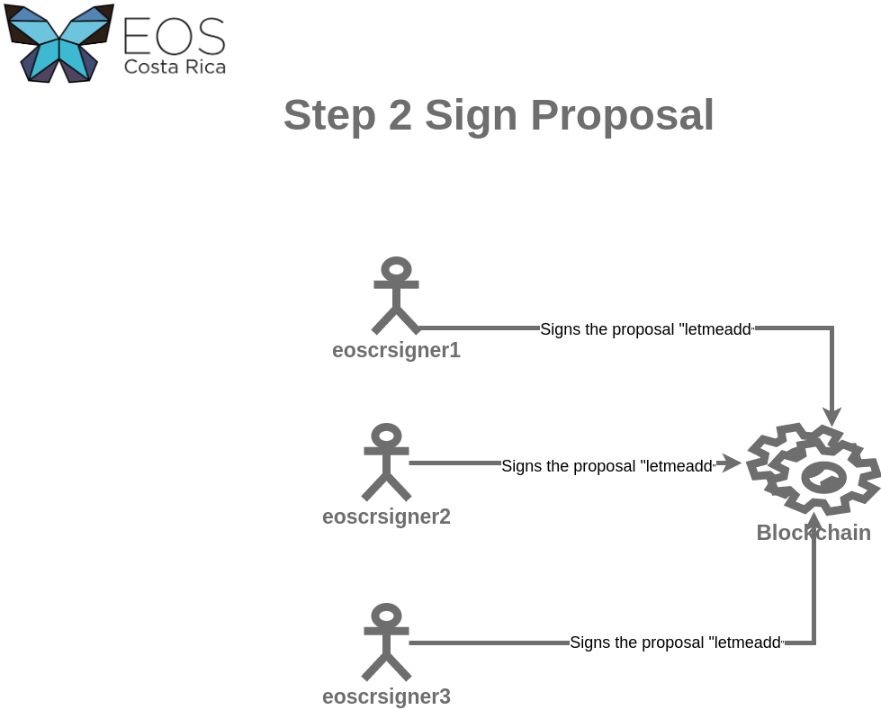
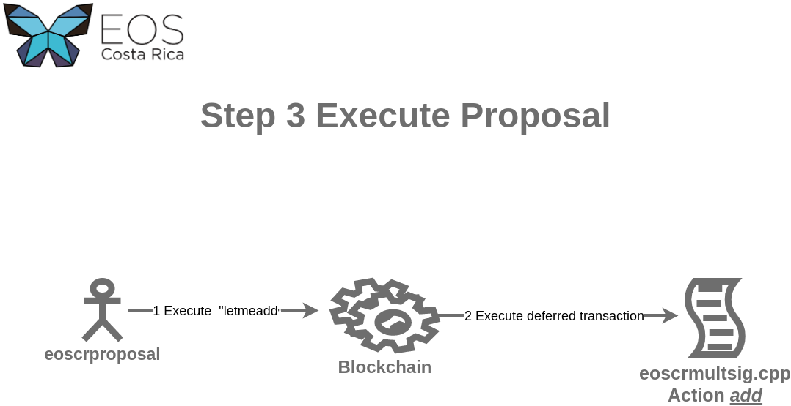

## Description
"Multisig is a term frequently used in the cryptographic and blockchain space. Essentially it enables multiple parties to sign or approve an action that takes place - typically a requirement for certain wallets, accounts, and smart contracts to prevent a rogue or hacked individual from performing detrimental actions"

[https://steemit.com/eos/@genereos/eos-multisig-tutorial ](https://steemit.com/eos/@genereos/eos-multisig-tutorial )

# Multisignatures example
Example of Smart contract eoscrmultsig using multisignature,the main propouse of this contract is to explain how multisignature feature works

## Requeriments:

  You need the private key pair for
  
- EOS5Rc8VJCyNCYPdE4gQhqPMTetFXkJPagkq4dicPCPGTAr5d4qu8

  The following accounts are required
   
  - eoscrmultsig: smart contract account
  - eoscrpropose : proposal creator 
  - eoscrsigner1 : signers accounts , each account must sign the proposal 
  - eoscrsigner2
  - eoscrsigner3

## how to compile
  type the follow command within the folder  eoscrmultsig
  - eosio-cpp eoscrmultsig.cpp -R ricardian -o eoscrmultsig.wasm -abigen

## how to publish
- cleos -u http://jungle2.cryptolions.io:80 set contract eoscrmultsig . -p eoscrmultsig@active


## Step 1: Create **letmeadd** proposal


> cleos -u http://jungle2.cryptolions.io:80 multisig propose letmeadd '[{"actor":"eoscrsigner1","permission":"active"},
>                                                                      {"actor":"eoscrsigner2","permission":"active"},
>                                                                      {"actor":"eoscrsigner3","permission":"active"}]' 
>                                                                       '[{"actor":"eoscrsigner1","permission":"active"},
>                                                                         {"actor":"eoscrsigner2","permission":"active"},
>                                                                         {"actor":"eoscrsigner3","permission":"active"}]' 
>                                                                          eoscrmultsig add '{"user_name":"username"}' eoscrpropose 1 -p eoscrpropose@active

## Step 2: Sign **letmeadd** proposal
all requested accounts must signs the proposal

- cleos -u http://jungle2.cryptolions.io:80 multisig approve eoscrpropose letmeadd '{"actor":"eoscrsigner1","permission":"active"}' -p eoscrsigner1@active
- cleos -u http://jungle2.cryptolions.io:80 multisig approve eoscrpropose letmeadd '{"actor":"eoscrsigner2","permission":"active"}' -p eoscrsigner2@active
- cleos -u http://jungle2.cryptolions.io:80 multisig approve eoscrpropose letmeadd '{"actor":"eoscrsigner3","permission":"active"}' -p eoscrsigner3@active

 

## Step 3: Execute the **letmeadd** proposal


The account eoscrproposal execute the proposal with the follow command:
> cleos -u http://jungle2.cryptolions.io:80 multisig exec eoscrpropose letmeadd eoscrmultsig

Now the proposal execute the action **add**, the result can be seen within the user table
> cleos -u http://jungle2.cryptolions.io:80 get table eoscrmultsig eoscrmultsig users
## NOTE:
if the authorization is enable **require_auth(_self);**
```
ACTION add (name user_name) {
    require_auth(_self);
     ...
}
```
**{"actor":"eoscrmultsig","permission":"active"}** must be included within proposal definition, and its signature is required
> cleos -u http://jungle2.cryptolions.io:80 multisig approve eoscrpropose letmeadd '{"actor":"eoscrmultsig","permission":"active"}' -p eoscrmultsig@active
#### More multisig subcommands:
  - **propose**                     Propose action
  - **propose_trx**                 Propose transaction
  - **review**                      Review transaction
  - **approve**                     Approve proposed transaction
  - **unapprove**                   Unapprove proposed transaction
  - **invalidate**                  Invalidate all multisig approvals of an account
  - **cancel**                      Cancel proposed transaction
  - **exec**                        Execute proposed transaction

 
